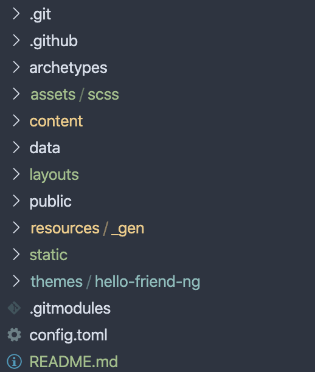
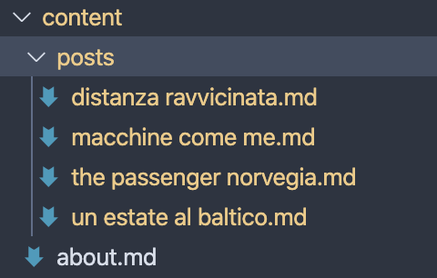
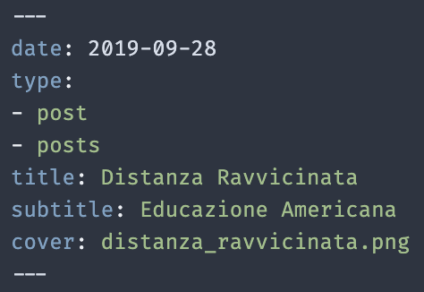

# Come scrivere un articolo

## Prerequisiti

Per scrivere un articolo, è necessario avere installato il software Git sul computer. Se mancante, segui le istruzioni di installazione sul [sito ufficiale](https://git-scm.com/).

**N.B. Durante l'installazione verrà chiesto se si vuole anche installare il terminale GitBash, la risposta è SI.**

## Scaricare il sito offline

Prima di tutto, bisogna scaricare la *repository* (a.k.a. la cartella con il codice su GitHub) e metterla in una cartella del computer. Per farlo:

1. Posizionati con l'Esplora Risorse nella cartella madre in cui vuoi che il codice venga scaricato. **N.B. la cartella madre è ad un livello superiore della cartella con il codice, questo perchè Git creerà automaticamente la cartella in cui verrà inserito il codice.**

2. *Tasto destro + "Open GitBash terminal here"*. Questo comando farà aprire una finestra del terminale nella cartella madre.

3. Esegui questo comando (se richiesto, dovrai inserire le tue credenziali GitHub):

```bash
git clone https://github.com/elisateneggi/elisateneggi-source.git
```

Se tutto è andato a buon fine, dovresti vedere una nuova cartella chiamata *elisateneggi-source* all'interno della cartella madre.

## Aprire la cartella in un editor di codice

Una volta scaricata la cartella, è possibile aprirla in un editor di codice di piacimento, questa scelta NON è influente sulla scrittura di un articolo. Esempi di editor di codice adatti sono: [Sublime Text](https://www.sublimetext.com/), [Visual Studio Code](https://code.visualstudio.com/), [NotePad ++](https://notepad-plus-plus.org/downloads/).

All'apertura dell'editor, la struttura della cartella aperta dovrebbe essere la seguente:  


L'**unica** cartella che ci serve modificare per aggiungere o modificare contenuti è ```/content```. 

## La cartella ```/content```



La cartella content contiene file con estensione ```.md``` che sta ad indicare *markdown*. Il [Markdown](https://en.wikipedia.org/wiki/Markdown) è un linguaggio di *markup* (ironic, right?) che permette la formattazione di contenuti testuali. Questo file, per esempio, è un esempio di file ```.md```.

Piccola digressione. La potenza del framework che stiamo utilizzando: [Hugo](https://gohugo.io/) è proprio di sfruttare la formattazione Markdown per astrarre la scrittura di pagine web. Sarà infatti Hugo a tradurre il contenuto degli articoli, completamente testuale, in HTML, seguendo le regole definite dal nostro tema.

Intuitivamente, vediamo un file ```about.md``` che contiene il contenuto della pagina *About me* e una cartella ```/post``` che contiene gli articoli. Sounds like WordPress right?

## I singoli post

I singoli post non sono nulla di più di pagine di testo che rispettino le [regole Markdown](https://www.markdownguide.org/cheat-sheet/), con l'aggiunta di una sezione iniziale che definisce i parametri dell'articolo:



